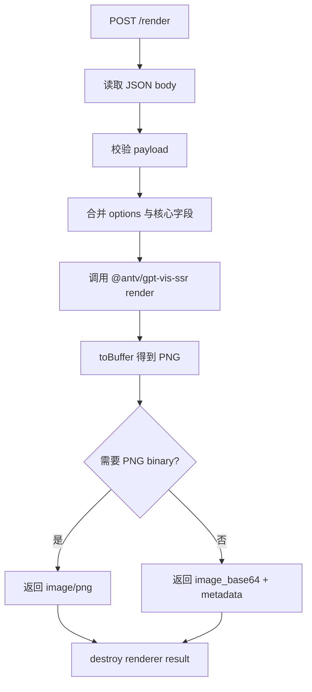

# Chart Renderer Service

`chart-renderer` 是一个可独立运行的私有 GPT-Vis SSR 渲染服务。它只负责把结构化 chart payload 渲染为 PNG，不负责 payload hash、图片缓存、静态 URL、审计或报告 metadata。

当前仓库内服务目录：`services/chart-renderer`

独立项目迁出时，可以把整个 `services/chart-renderer` 目录作为项目根目录。

## 文档索引

- Agent 调用 API 文档：`docs/api.md`
- CHART-001 实施计划：`docs/implementation-plan.md`
- CHART-002 Cloudflare Worker Serverless 改造计划：`docs/serverless-implementation-plan.md`
- 独立迁出检查清单：`docs/standalone-readiness.md`

## Serverless 改造方向

新的目标方案是将本服务改造为 Cloudflare Worker 上的图表产物服务，不再在服务端生成 PNG。Worker 负责校验 payload、生成 hash、缓存和返回 SVG/HTML/config；PNG 下载迁移到浏览器端完成。

详细计划见：`docs/serverless-implementation-plan.md`。

## 当前状态

状态：已完成 CHART-001 基础交付。

已完成：

- 新增独立 Node.js 服务目录 `services/chart-renderer`。
- 接入并固定 `@antv/gpt-vis-ssr@0.3.7`。
- 提交 `package-lock.json`，Dockerfile 使用 `npm ci` 基于 lockfile 安装依赖。
- 提供 `GET /health` 和 `POST /render`。
- 支持 `type`、`data`、`title`、`width`、`height`、`options`。
- 支持主题 `default`、`dark`、`academy`。
- 支持常用类型 `line`、`bar`、`column`、`pie`、`area`、`waterfall`、`word-cloud`、`liquid`、`radar`、`table`、`summary`。
- 支持 JSON base64 响应和 PNG binary 响应。
- 提供独立 `.env.example` 和独立 `docker-compose.yml`。
- 不引用外层工程 `app/` 目录、不使用 `agent-model-configs`、不 import 外层工程 Python 模块。

已验证：

- `npm run smoke` 可生成非空 PNG buffer。
- `GET /health` 可返回服务和依赖版本。
- `POST /render` 可返回 JSON base64。
- `POST /render` 可通过 `Accept: image/png` 或 `response_format: "png"` 返回 PNG binary。
- 错误 payload 返回清晰 4xx，例如缺少 `data` 返回 422。
- 连续 60 次 HTTP render 后 RSS 增长收敛，未观察到明显线性泄漏。
- `npm run audit` 已通过，结果为 0 vulnerabilities。

待注意：

- 当前机器执行 Docker build 时卡在 Docker Hub `node:20-bookworm-slim` metadata 拉取阶段，镜像构建流程尚未在本机完整跑完。Dockerfile 已按 lockfile 安装依赖编写。
- 当前服务是无鉴权内网渲染服务，生产部署时应只暴露给上游 Chart API 服务或内网网关，不直接公网开放。

## 实现逻辑

运行入口：`src/server.js`

启动时：

1. 读取 `package.json`，用于 `/health` 和 renderer metadata。
2. 注册空 CSS loader，避免 `@antv/gpt-vis-ssr` 依赖中的 CSS import 影响 Node 运行。
3. 动态导入 `@antv/gpt-vis-ssr` 的 `render`。
4. 从环境变量读取 bind host、port 和最大 body 大小。

请求流程：



字段处理：

- `type`：必填字符串，会 trim。
- `data`：必填非空数组。
- `title`：可选字符串。
- `width`：可选整数，默认 `900`，范围 `100..4096`。
- `height`：可选整数，默认 `520`，范围 `100..4096`。
- `options`：可选对象，会先展开，再用核心字段覆盖，避免 options 覆盖 `type`、`data`、`width`、`height`。
- `response_format`：可选 `json` 或 `png`。

资源释放：

- 渲染成功或失败后，如果 `render()` 返回对象包含 `destroy()`，都会在 `finally` 中释放。
- 当前实现是单进程串接 HTTP 请求，不做 worker pool。后续如果并发渲染压力上升，可增加队列、并发上限或 worker pool。

响应策略：

- 默认返回 JSON，包含 `success`、`image_base64`、`metadata`。
- 请求体设置 `response_format: "png"` 或请求头包含 `Accept: image/png` 时返回 PNG binary。
- PNG 响应会通过 header 返回基础 metadata：`X-Chart-Provider`、`X-Chart-Type`、`X-Chart-Width`、`X-Chart-Height`、`X-Render-Duration-Ms`。

错误策略：

| 场景 | HTTP 状态 | error |
| --- | --- | --- |
| 非 `GET /health` 或 `POST /render` | 404 | `not_found` |
| body 为空、JSON 非法、body 超限 | 400 | `bad_request` |
| payload 字段不合法 | 422 | `invalid_chart_payload` |
| GPT-Vis SSR 渲染失败 | 500 | `render_failed` |
| 未预期内部错误 | 500 | `internal_error` |

## 配置说明

服务自己的配置文件放在 `services/chart-renderer/.env`。示例文件为 `services/chart-renderer/.env.example`。

| 变量 | 默认值 | 说明 |
| --- | --- | --- |
| `CHART_RENDERER_HOST` | `0.0.0.0` | HTTP bind host。 |
| `CHART_RENDERER_PORT` | `8787` | HTTP bind port。 |
| `CHART_RENDERER_MAX_BODY_BYTES` | `1000000` | 单次 JSON 请求体最大字节数。 |

示例：

```env
CHART_RENDERER_HOST=0.0.0.0
CHART_RENDERER_PORT=8787
CHART_RENDERER_MAX_BODY_BYTES=1000000
```

注意：

- 这些配置只服务于 Node renderer。
- 不读取外层工程根目录 `.env`。
- 不读取外层工程 `app/` 下的任何配置。
- 不读取 `agent-model-configs`。
- 外层工程如需通过 compose 启动本服务，应显式通过 `env_file` 指向本目录 `.env`。
- 上游服务中的 `GPT_VIS_SSR_ENDPOINT` 属于调用方配置，不属于 renderer 运行配置。

## 使用说明

安装依赖：

```bash
cd services/chart-renderer
npm ci
```

本地启动：

```bash
cp .env.example .env
npm run start:env
```

不加载 `.env` 启动：

```bash
npm start
```

独立 Docker Compose 启动：

```bash
cd services/chart-renderer
cp .env.example .env
docker compose up --build
```

从当前仓库根目录随整体服务启动时，根 `docker-compose.yml` 也会读取 `services/chart-renderer/.env`：

```bash
docker compose up chart-renderer --build
```

健康检查：

```bash
curl -s http://127.0.0.1:8787/health
```

返回 JSON base64：

```bash
curl -s -X POST http://127.0.0.1:8787/render \
  -H "Content-Type: application/json" \
  -d '{
    "type": "line",
    "width": 900,
    "height": 520,
    "title": "Smoke test",
    "data": [
      {"time": "2026-05-01", "value": 1.12},
      {"time": "2026-05-02", "value": 1.18}
    ]
  }'
```

返回 PNG binary：

```bash
curl -s -X POST http://127.0.0.1:8787/render \
  -H "Content-Type: application/json" \
  -H "Accept: image/png" \
  -d '{
    "type": "line",
    "width": 900,
    "height": 520,
    "title": "Smoke test",
    "data": [
      {"time": "2026-05-01", "value": 1.12},
      {"time": "2026-05-02", "value": 1.18}
    ]
  }' \
  -o /tmp/chart-renderer-smoke.png
```

内置 smoke test：

```bash
npm run smoke
```

依赖审计：

```bash
npm run audit
```

## 与上游 Chart API 的边界

`chart-renderer` 只负责渲染：

- 接收结构化 payload。
- 调用 `@antv/gpt-vis-ssr`。
- 返回 PNG binary 或 base64。
- 返回 renderer metadata。

上游 Chart API 服务负责：

- provider 选择。
- payload 规范化和 SHA256 hash。
- 图片缓存和 `/chart-assets/{hash}.png` 静态 URL。
- 远程 AntV Studio fallback。
- trace id、审计、报告 metadata。
- 对外 API 和后续 Agent Tool 注册。
