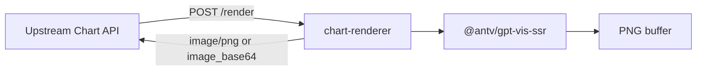

# CHART-001 私有 GPT-Vis SSR Renderer 专项计划

> Legacy note: this document describes the historical CHART-001 Node.js PNG SSR implementation. It is not the current default runtime. The active implementation is CHART-002 Cloudflare Worker, documented in `docs/serverless-implementation-plan.md`. The Node SSR files have been isolated under `legacy/node-ssr/`.

## Summary

建设一个独立的 Node.js `chart-renderer` 服务，基于 `@antv/gpt-vis-ssr` 将结构化 chart payload 渲染为 PNG。该服务作为私有部署的本地 renderer，不依赖 `antv-studio.alipay.com`，也不依赖外层工程 `app/` 目录或外层工程 agent 模型配置。

## Scope

包含：

- 新增独立服务目录 `services/chart-renderer`。
- 接入 `@antv/gpt-vis-ssr`。
- 固定依赖版本并提交 lockfile。
- 提供 `GET /health` 和 `POST /render`。
- 支持 JSON base64 和 PNG binary 响应。
- 提供本服务自己的 `.env.example`、`.env` 使用说明和独立 `docker-compose.yml`。
- 加入根 `docker-compose.yml`，供整体图表生成服务调用。
- 形成 smoke test、依赖审计和本地 HTTP 验证步骤。

不包含：

- 不实现 payload builder。
- 不实现图片缓存。
- 不生成静态 URL。
- 不写入报告 metadata。
- 不接入 Agent Tool Registry。
- 不提供公网鉴权能力。

## Architecture



部署边界：

- `chart-renderer` 是独立 Node 进程。
- 上游 Chart API 服务通过 HTTP 调用它。
- 生产默认由上游 Chart API 服务挂载缓存和静态资产，renderer 不持久化文件。
- renderer 可在 `services/chart-renderer` 目录中单独启动和测试。

## Public Interfaces

### GET /health

返回：

```json
{
  "status": "ok",
  "service": "chart-renderer",
  "version": "0.1.0",
  "provider": "gpt_vis_ssr",
  "dependency": {
    "@antv/gpt-vis-ssr": "0.3.7"
  }
}
```

### POST /render

请求：

```json
{
  "type": "line",
  "data": [
    {"time": "2026-05-01", "value": 1.12},
    {"time": "2026-05-02", "value": 1.18}
  ],
  "title": "Smoke test",
  "width": 900,
  "height": 520,
  "options": {},
  "response_format": "json"
}
```

字段：

| 字段 | 必填 | 说明 |
| --- | --- | --- |
| `type` | 是 | GPT-Vis SSR chart type。 |
| `data` | 是 | 非空数组。 |
| `title` | 否 | 图表标题。 |
| `width` | 否 | 默认 `900`，范围 `100..4096`。 |
| `height` | 否 | 默认 `520`，范围 `100..4096`。 |
| `options` | 否 | 透传给 GPT-Vis SSR 的配置对象。 |
| `response_format` | 否 | `json` 或 `png`。 |

默认 JSON 响应：

```json
{
  "success": true,
  "image_base64": "...",
  "metadata": {
    "provider": "gpt_vis_ssr",
    "renderer_version": "0.3.7",
    "chart_type": "line",
    "width": 900,
    "height": 520,
    "byte_length": 73797,
    "duration_ms": 235.42
  }
}
```

PNG 响应：

- 请求体设置 `response_format: "png"`；或
- 请求头设置 `Accept: image/png`。

响应 content type 为 `image/png`，metadata 放在响应 header。

## Configuration

配置文件位置：

- 示例：`services/chart-renderer/.env.example`
- 本地：`services/chart-renderer/.env`

| 变量 | 默认值 | 说明 |
| --- | --- | --- |
| `CHART_RENDERER_HOST` | `0.0.0.0` | HTTP bind host。 |
| `CHART_RENDERER_PORT` | `8787` | HTTP bind port。 |
| `CHART_RENDERER_MAX_BODY_BYTES` | `1000000` | 单次 JSON 请求体最大字节数。 |

独立性要求：

- 不读取外层工程根目录 `.env`。
- 不 import 或读取 `app/` 目录。
- 不使用 `agent-model-configs`。
- 不调用外层工程数据库。
- 外层工程如需通过 compose 启动本服务，必须通过 `env_file: ./services/chart-renderer/.env` 加载 renderer 运行配置。
- 上游服务中的 `GPT_VIS_SSR_ENDPOINT` 等 endpoint 配置属于调用方配置，不属于 renderer 运行配置。

## Implementation Notes

- 使用 Node 内置 `http` 模块，避免引入额外 Web framework。
- 使用 `require.extensions[".css"] = () => {}` 处理依赖中的 CSS import。
- 使用动态 import 加载 `@antv/gpt-vis-ssr`。
- `options` 会先展开，随后用 `type`、`data`、`title`、`width`、`height` 覆盖，保证核心字段不被 options 覆盖。
- 渲染完成后通过 `toBuffer()` 获取 PNG。
- 在 `finally` 中调用 `result.destroy()`，释放 renderer 资源。
- Dockerfile 使用 `npm ci --omit=dev`，避免依赖漂移。

## Deliverables

状态：已完成

- 新增独立 Node.js renderer 服务目录。
- 接入 `@antv/gpt-vis-ssr`。
- 固定 `@antv/gpt-vis-ssr` 版本并提交 lockfile。
- 提供 `POST /render` 和 `GET /health`。
- 支持 `width`、`height`、`type`、`data`、`title`、`options`。
- 只返回 PNG binary 或 base64 和 renderer metadata。
- Docker Compose 中加入 renderer 服务。
- 提供独立 `.env.example` 和独立 compose。
- renderer 运行时 env 配置已迁移到 `services/chart-renderer/.env`，根 compose 通过 `env_file` 引用。
- 补充服务内 README 和 docs。

## Acceptance

状态：基本完成

- 本地无需访问 `antv-studio.alipay.com` 即可生成 PNG。
- renderer 对错误 payload 返回清晰 4xx/5xx。
- 连续多次渲染无明显内存泄漏。
- Docker 构建使用 lockfile 安装依赖。
- 有 `npm audit` 或等效依赖检查记录。

当前验证记录：

- `npm ci`：已通过。
- `npm run smoke`：已通过，生成非空 PNG buffer。
- `GET /health`：已通过。
- `POST /render` JSON base64：已通过。
- `POST /render` PNG binary：已通过。
- invalid payload：已通过，返回 422。
- 60 次 HTTP render：RSS 增长收敛，未观察到明显线性泄漏。
- `npm run audit`：已通过，0 vulnerabilities。
- `docker compose config --services`：根 compose 已包含 `chart-renderer`。
- `docker compose -f services/chart-renderer/docker-compose.yml config --services`：独立 compose 已包含 `chart-renderer`。

限制记录：

- 当前机器 Docker build 卡在 Docker Hub `node:20-bookworm-slim` metadata 拉取阶段，因此没有完成本机镜像构建验证。

## Test Plan

服务内验证：

```bash
cd services/chart-renderer
npm ci
npm run smoke
npm run audit
npm run start:env
```

HTTP 验证：

```bash
curl -s http://127.0.0.1:8787/health
```

```bash
curl -s -X POST http://127.0.0.1:8787/render \
  -H "Content-Type: application/json" \
  -H "Accept: image/png" \
  -d '{"type":"line","width":900,"height":520,"data":[{"time":"2026-05-01","value":1.12},{"time":"2026-05-02","value":1.18}],"title":"Smoke test"}' \
  -o /tmp/chart-renderer-smoke.png
```

错误 payload 验证：

```bash
curl -s -X POST http://127.0.0.1:8787/render \
  -H "Content-Type: application/json" \
  -d '{"type":"line","data":[]}'
```

Compose 验证：

```bash
docker compose config --services
docker compose -f services/chart-renderer/docker-compose.yml config --services
```

## Follow-ups

- 增加并发上限和队列，避免大图或大数据请求打满 renderer。
- 增加 request id header，便于跨服务追踪。
- 增加结构化日志。
- 增加 `/metrics`，暴露 render count、duration、error count、RSS 等指标。
- 评估 worker pool，提升并发稳定性。
- 在 CI 或可访问 Docker Hub 的环境补齐 Docker build 验证。
