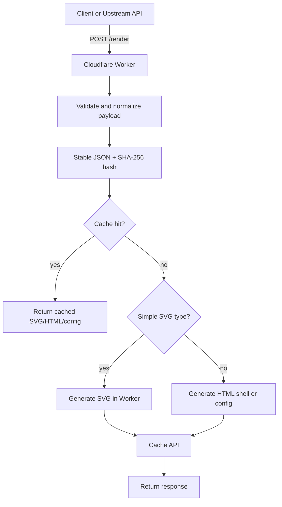

# CHART-002 Cloudflare Worker Serverless 改造计划

## Summary

将 `chart-renderer` 从 Node.js PNG SSR 服务改造为 Cloudflare Worker 上的轻量图表产物服务。新服务不再在服务端生成 PNG，而是按图表复杂度返回 SVG、HTML 或标准化 config。

核心判断：

- Worker 适合生成轻量文本产物、做 payload 校验、hash、缓存和分发。
- 当前 `canvas`、`@antv/gpt-vis-ssr`、PNG buffer 输出不适合 Worker 运行时。
- PNG 生成应迁移到浏览器端下载流程，除非未来明确引入专门 WASM renderer 并严格控制复杂度。

## Goals

- 适配 Cloudflare Worker runtime。
- 移除 Worker 路径中的 `canvas` 和 `@antv/gpt-vis-ssr`。
- 将产品契约从服务端 PNG 改为：
  - 简单图表返回 SVG。
  - 复杂图表返回 HTML 或 config，由浏览器端渲染。
- 使用 payload hash 作为缓存 key。
- 支持浏览器端预览和下载 SVG、PNG、JSON config。

## Decisions

已确认的第一阶段决策：

- 缓存只使用 Cloudflare Workers Cache API。
- R2 不在第一阶段实现，只作为后续可选升级项保留在工程文档中。
- `/viewer` 由 Worker 直接返回 HTML，不使用 Cloudflare Workers Static Assets。
- 生产鉴权交给上游 API gateway，Worker 内只做输入限制、错误处理和必要的防滥用边界。
- HTML shell 使用 `@antv/gpt-vis@0.6.1` 作为客户端复杂图表渲染库。

## Non-goals

- 不在 Worker 中生成 PNG。
- 不把 `@antv/gpt-vis-ssr` 搬入 Worker。
- 不在第一阶段重写所有复杂图表的 SVG renderer。
- 不引入 Playwright、Puppeteer、Node canvas、Sharp、librsvg 等服务端渲染依赖。
- 不在 Worker 内实现完整生产鉴权；生产鉴权由上游 API gateway 负责。

## Product Contract

### Supported Response Formats

| Format | Content-Type | 生成位置 | 适用场景 |
| --- | --- | --- | --- |
| `svg` | `image/svg+xml; charset=utf-8` | Worker | `line`、`bar`、`column`、`pie`、`summary` 等简单图表 |
| `html` | `text/html; charset=utf-8` | Worker 组装 shell，浏览器渲染 | 复杂图表、交互图表、需要客户端库的图表 |
| `config` | `application/json; charset=utf-8` | Worker | 上游或浏览器自行接管渲染 |

`png` 不再是服务端支持格式。收到 `response_format: "png"` 或 `Accept: image/png` 时，返回清晰错误：

```json
{
  "error": "unsupported_response_format",
  "message": "Server-side PNG rendering is not supported in the Worker version. Use svg/html/config and download PNG in the browser."
}
```

建议 HTTP 状态使用 `422`。如需强调旧接口退役，也可以对明确的 legacy PNG 请求返回 `410`。

### Chart Type Strategy

| Chart type | 第一阶段输出 | 说明 |
| --- | --- | --- |
| `line` | SVG | Worker 手写 SVG path、坐标轴、标题、tooltip metadata 可选 |
| `bar` | SVG | 横向条形图 |
| `column` | SVG | 纵向柱状图 |
| `pie` | SVG | 使用 path arc 生成扇区 |
| `summary` | SVG | 从当前 canvas 卡片逻辑迁移为 SVG |
| `area` | HTML/config | 后续可补 SVG |
| `waterfall` | HTML/config | 第一阶段交给浏览器端图表库 |
| `word-cloud` | HTML/config | 避免在 Worker 中做复杂布局 |
| `liquid` | HTML/config | 动画和渐变交给浏览器端 |
| `radar` | HTML/config | 第一阶段交给浏览器端图表库 |
| `table` | HTML/config | 浏览器端渲染更适合文本测量和下载 |

## API Design

### GET /health

返回 Worker 服务状态和能力描述：

```json
{
  "status": "ok",
  "service": "chart-renderer",
  "version": "0.2.0",
  "runtime": "cloudflare-worker",
  "formats": ["svg", "html", "config"],
  "simple_svg_types": ["line", "bar", "column", "pie", "summary"]
}
```

### POST /render

请求示例：

```json
{
  "type": "line",
  "data": [
    {"time": "2026-05-01", "value": 1.12},
    {"time": "2026-05-02", "value": 1.18}
  ],
  "title": "Smoke test",
  "width": 900,
  "height": 520,
  "theme": "default",
  "options": {},
  "response_format": "svg"
}
```

响应选择规则：

1. 如果 `response_format` 是 `svg`，且 chart type 支持 SVG，返回 SVG。
2. 如果 `response_format` 是 `config`，返回标准化 config。
3. 如果 `response_format` 是 `html`，返回可独立预览和下载的 HTML。
4. 如果未传 `response_format`：
   - 简单图表默认返回 SVG。
   - 复杂图表默认返回 HTML。

SVG 响应 headers：

| Header | 说明 |
| --- | --- |
| `Content-Type` | `image/svg+xml; charset=utf-8` |
| `Cache-Control` | 默认 `public, max-age=31536000, immutable`，前提是 hash key 不变 |
| `ETag` | payload hash |
| `X-Chart-Hash` | payload hash |
| `X-Chart-Type` | 标准化图表类型 |
| `X-Chart-Renderer` | `worker-svg` |
| `X-Chart-Cache` | `hit` 或 `miss` |

JSON config 响应：

```json
{
  "success": true,
  "hash": "sha256:...",
  "renderer": "client-config",
  "format": "config",
  "chart": {
    "type": "line",
    "data": [],
    "title": "Smoke test",
    "width": 900,
    "height": 520,
    "theme": "default",
    "options": {}
  },
  "metadata": {
    "cache": "miss"
  }
}
```

### GET /artifact/:hash

可选接口。用于读取已缓存产物：

- Cache API 命中时直接返回。
- Cache miss 时返回 `404`。

第一阶段也可以不暴露该接口，只在 `POST /render` 内做透明缓存。

### GET /viewer

由 Worker 直接返回 HTML 的前端入口，不使用 Cloudflare Workers Static Assets。

能力：

- 粘贴 payload。
- 选择输出格式。
- 预览 SVG 或浏览器端渲染图表。
- 下载 `.svg`。
- 下载 `.json` config。
- 浏览器端导出 `.png`。

## Architecture



## Code Layout

建议目录：

```text
src/
  worker.js
  schema.js
  hash.js
  response.js
  cache.js
  renderers/
    svg/
      common.js
      line.js
      bar.js
      column.js
      pie.js
      summary.js
    client-config.js
    html-shell.js
  viewer/
    index.html
    viewer.js
    viewer.css
```

职责：

| 文件 | 职责 |
| --- | --- |
| `worker.js` | Worker `fetch` 入口、路由、错误处理 |
| `schema.js` | payload 校验、type alias、theme、尺寸限制 |
| `hash.js` | stable stringify、SHA-256 生成 |
| `cache.js` | Cache API 读写 |
| `renderers/svg/common.js` | SVG escaping、scale、axis、theme helper |
| `renderers/svg/*.js` | 简单图表 SVG renderer |
| `renderers/client-config.js` | 输出浏览器端图表配置 |
| `renderers/html-shell.js` | 生成可预览、可下载的 HTML |

## Package and Runtime Changes

`package.json` 调整：

- 移除 `canvas`。
- 移除 `@antv/gpt-vis-ssr`。
- 增加 `wrangler` 作为 dev dependency。
- HTML shell 固定从 CDN 加载 `@antv/gpt-vis@0.6.1`。
- 增加脚本：
  - `dev`: `wrangler dev`
  - `deploy`: `wrangler deploy`
  - `smoke`: 调用 Worker 本地端口验证 SVG/config/html

新增 `wrangler.toml`：

```toml
name = "chart-renderer"
main = "src/worker.js"
compatibility_date = "2026-05-28"

[vars]
MAX_BODY_BYTES = "1000000"
```

第一阶段不配置 `r2_buckets`。如后续启用 R2，再在 `wrangler.toml` 中增加 bucket binding。

## Client Chart Library

HTML shell 使用 `@antv/gpt-vis@0.6.1`。

选择理由：

- 最贴近当前 `@antv/gpt-vis-ssr` 的 payload 思路，复杂图表迁移成本最低。
- 第一阶段可优先把标准化 payload 交给 GPT-Vis 客户端渲染，避免手写复杂图表 grammar。
- 与 Worker 目标匹配：Worker 只返回 HTML/config，实际复杂渲染发生在浏览器端。

备选项：

| 方案 | 状态 | 取舍 |
| --- | --- | --- |
| `@antv/gpt-vis@0.6.1` | 采用 | 兼容现有 payload 思路，迁移最快 |
| `@antv/g2@5.4.0` | 备选 | 更底层、更可控，但需要维护 payload 到 G2 spec 的映射 |
| Hybrid | 暂不采用 | 灵活但复杂度和测试矩阵更高 |

## Caching Plan

### Hash

使用标准化后的 payload 生成 hash，避免字段顺序导致缓存失效：

1. normalize chart type、theme、width、height、options。
2. 移除非渲染字段，例如 trace id、request id。
3. 对对象 key 做稳定排序。
4. 使用 `crypto.subtle.digest("SHA-256", bytes)`。
5. key 形如：

```text
chart:v2:{format}:{sha256}
```

### Cache API

- 适合边缘本地缓存。
- 对同一 POP 内热点请求收益高。
- 使用 `caches.default.match(cacheRequest)` 和 `caches.default.put(cacheRequest, response)`。
- 缓存不可变产物时设置长期 `Cache-Control`。

### Optional R2 Upgrade

R2 不在第一阶段实现，只作为后续可选持久层：

- 适合跨 POP 复用和长期保存。
- key 可用 `{format}/{sha256}.{ext}`。
- metadata 保存 chart type、width、height、renderer、created_at。

如后续启用 R2，需要补充 `wrangler.toml` bucket binding、R2 读写逻辑和对应验收测试。

## Browser Download Plan

浏览器端下载能力放在 Worker 直接返回的 `/viewer` 中实现。调用方前端也可以复用同样逻辑。

### SVG Download

- Worker 返回 SVG 字符串。
- 前端用 `Blob([svg], { type: "image/svg+xml" })` 创建下载链接。

### Config Download

- 将标准化 config 序列化为 JSON。
- 下载为 `{hash}.json`。

### PNG Download

推荐浏览器端路径：

1. SVG 简单图表：
   - 将 SVG 放入 `Image`。
   - 绘制到 `<canvas>`。
   - `canvas.toBlob("image/png")` 下载。
2. HTML/client-rendered 复杂图表：
   - 优先使用图表库自带导出能力。
   - 或使用 `html-to-image` / `dom-to-image-more` 一类浏览器端工具。

注意：

- PNG 导出发生在用户浏览器，不占用 Worker CPU。
- 如有跨域图片或字体，需确保 CORS 和字体加载策略正确，否则 canvas 会 taint。

## Security and Limits

- 限制请求体大小，默认 `1 MB`。
- 限制 `width`、`height`，建议 `100..4096`。
- 限制 `data.length`，简单 SVG 第一阶段建议不超过 `1000` 点。
- 对所有 SVG 文本做 XML escaping。
- 禁止将用户输入直接拼入 `<script>`，HTML shell 中 config 使用 JSON script tag 或安全序列化。
- 生产鉴权由上游 API gateway 负责；Worker 不实现业务鉴权。
- 对 Cache key 只使用 hash，不使用原始 title 或用户文本。

## Migration Phases

### Phase 1: Worker Skeleton and Contract

状态：已实现。

- 新增 `src/worker.js` 和 `wrangler.toml`。
- `package.json` 增加 `dev` 和 `deploy` 脚本，`dev` 运行 `wrangler dev`。
- 迁移 payload 校验逻辑：
  - payload 必须是 JSON object。
  - `type` 必填。
  - `options` 必须是 object。
  - `theme` 支持 `default`、`dark`、`academy`，`light` 归一化为 `default`。
  - `width`、`height` 范围为 `100..4096`。
  - 除 `liquid` 外，`data` 必须是非空数组。
  - `liquid` 需要 `percent` 或 `options.percent`，范围 `0..1`。
- 实现 `GET /health`，返回 Worker runtime、当前已实现格式和后续计划格式。
- 实现 `POST /render` 的 `config` 响应：
  - 默认 `response_format` 为 `config`。
  - 返回标准化 `chart` config、`sha256` hash、`renderer: "client-config"` 和 metadata。
  - 响应头返回 `ETag`、`X-Chart-Hash`、`X-Chart-Type`、`X-Chart-Renderer`、`X-Chart-Cache`。
- 对 `png` 请求返回 `422 unsupported_response_format`。
- 对 `svg` 和 `html` 请求返回 `501 response_format_not_implemented`，避免未完成能力被误用。
- 更新 API 文档，标记 PNG SSR 为 legacy。

验收：

- `wrangler dev` 可启动。
- `GET /health` 正常。
- `POST /render response_format=config` 正常。
- `response_format=png` 返回预期错误。

### Phase 2: Simple SVG Renderers

状态：已实现。

- 新增 Worker SVG renderer，支持 `line`、`bar`、`column`、`pie`、`summary`。
- `response_format: "svg"` 对简单图表返回 `image/svg+xml; charset=utf-8`。
- SVG 响应包含 `ETag`、`X-Chart-Hash`、`X-Chart-Type`、`X-Chart-Renderer: worker-svg`、`X-Chart-Cache`。
- 复杂图表请求 SVG 时返回 `422 unsupported_svg_chart_type`，提示改用 `config` 或后续 `html`。
- 所有 SVG 用户文本做 XML escaping，避免标题、类目、摘要文本中的 `<`、`>`、`&` 破坏 SVG。
- 增加 `npm run svg:smoke` 字符串结构测试，覆盖 5 种 SVG 类型。

验收：

- 简单图表返回非空 SVG。
- SVG 包含合法 `<svg>`、`viewBox`、title、主要图形节点。
- 特殊字符不会破坏 SVG。

### Phase 3: HTML Shell and Viewer

状态：已实现。

- 实现复杂图表 HTML shell，`response_format: "html"` 返回 `text/html; charset=utf-8`。
- HTML shell 引入 `@antv/gpt-vis@0.6.1` UMD 浏览器脚本，并用 `vis-chart` markdown block 渲染图表。
- 对 GPT-Vis 默认组件不支持或 CDN 加载失败的场景，提供内置浏览器 fallback renderer，已覆盖 `radar`。
- 提供 JSON、SVG、PNG 下载能力：
  - JSON 下载当前标准化 config。
  - SVG 优先序列化当前页面内真正的图表 SVG；简单图表也可请求 Worker SVG；复杂 canvas 图表导出为包含 canvas PNG data URL 的 SVG 包装。
  - PNG 优先导出当前图表 canvas，或把当前 SVG rasterize 到 browser canvas；非 SVG DOM 可走 `html-to-image`。
- chart `width`、`height` 是图表产物和下载图片的目标尺寸；预览区域按该尺寸动态扩展，只负责完整展示图表。
- 覆盖 GPT-Vis 内部 300px 容器高度限制，并在渲染后按 GPT-Vis 工作区触发 resize/reflow，让 GPT-Vis/G2 按目标尺寸完成自身 canvas 生成，避免 styled-component class 变化导致图表变形、偏小或被裁切。
- `/viewer` 提供 Theme、W、H 和 Apply 控件；只有点击 Apply，或在 W/H 输入框按 Enter，才会把控件值同步到 payload 的 `theme`、`width`、`height` 后重新渲染；控件分行排布，避免窄边栏溢出。
- `/viewer` 的页面预览容器保持中性的白色工作区，不随 `theme` 改变；浏览器端渲染复杂图表时保留并传递 Worker config 的 `theme`，由图表库应用主题。
- 增加由 Worker 直接返回的 `/viewer`，支持编辑 payload、请求 config/svg/html、预览和下载。

验收：

- 复杂图表可以在浏览器端渲染。
- SVG 和 config 可下载。
- PNG 可在浏览器端导出。

### Phase 4: Cache API - Implemented

- 实现 stable hash。
- 实现 Cache API match/put。
- 增加 `ETag`、`X-Chart-Hash`、`X-Chart-Cache`。

实现说明：

- hash 输入为标准化 chart config，而不是原始请求字符串。
- `stableStringify` 对 object key 排序，对 array 保持顺序，因此字段顺序不同但语义等价的 payload 会得到相同 hash。
- Cache API key 为 `/{origin}/__chart-cache/{cache_namespace}/{format}/{hash}`，避免把用户 title 或其他原文放入 cache URL；`cache_namespace` 用于 renderer、下载逻辑或 HTML shell 变更后的缓存隔离。
- miss 时生成 SVG/HTML/config，并写入 `caches.default.put()`；hit 时直接返回缓存产物。
- 当前仅使用 Workers Cache API；R2 仍保留为后续可选升级。

验收：

- 同一 payload 第二次请求返回 `X-Chart-Cache: hit`。
- 不同字段顺序的等价 payload 命中同一 hash。

### Phase 5: Optional R2 Persistence Documentation - Documented

- 不实现 R2 代码。
- 在工程文档中保留 R2 后续升级方案。

状态：已文档化，当前代码和 `wrangler.toml` 不包含 R2 binding、R2 读写逻辑或 artifact 回源路由。

Phase 5 的目标不是把 R2 接入当前 Worker，而是为后续明确升级边界，避免第一阶段把 Cache API-only 方案复杂化。

#### 什么时候需要 R2

继续只用 Cache API 的场景：

- 产物可以按 payload 重新生成。
- 不要求跨 POP 强一致复用。
- 不要求长期留存、审计、分享固定 artifact URL。
- 成本和复杂度优先于持久化命中率。

考虑升级到 R2 的触发条件：

- 需要跨 Cloudflare POP 复用同一 hash 产物，减少重复生成 HTML/SVG/config。
- 需要长期保存图表产物用于报告归档、审计或异步下载。
- 需要公开或半公开的固定 artifact URL，例如 `GET /artifact/:hash`。
- 需要保存 artifact metadata，例如 chart type、renderer、format、width、height、created_at、content_type。
- 需要从 Cache API miss 中恢复，而不是每次都重新渲染。

#### 建议的 R2 产物模型

R2 object key 建议包含版本、format 和 hash：

```text
charts/{artifact_namespace}/{format}/{hash}
charts/{artifact_namespace}/{format}/{hash}.metadata.json
```

示例：

```text
charts/worker-v14/svg/sha256:abc123
charts/worker-v14/html/sha256:abc123
charts/worker-v14/config/sha256:abc123
charts/worker-v14/config/sha256:abc123.metadata.json
```

metadata 建议字段：

```json
{
  "hash": "sha256:...",
  "format": "svg",
  "chart_type": "line",
  "renderer": "worker-svg",
  "width": 900,
  "height": 520,
  "theme": "default",
  "content_type": "image/svg+xml; charset=utf-8",
  "created_at": "2026-05-29T00:00:00.000Z",
  "artifact_namespace": "worker-v14"
}
```

注意：

- hash 仍应来自标准化 chart config，而不是原始请求字符串。
- `artifact_namespace` 应独立于代码版本；当 HTML shell、下载语义、renderer 输出或 config contract 改变时递增。
- 不建议把用户 title 或原始 payload 放进 object key。

#### 建议的读写顺序

如果未来实现 R2，建议请求链路为：

1. 规范化 payload。
2. 计算 stable hash。
3. 查 `caches.default`。
4. Cache hit：直接返回。
5. Cache miss：查 R2 object。
6. R2 hit：构造响应，回填 Cache API，然后返回 `X-Chart-Cache: r2-hit` 或保留 `hit` 并增加 `X-Chart-Storage: r2`。
7. R2 miss：生成 SVG/HTML/config。
8. 写 R2 object 和 metadata。
9. 写 Cache API。
10. 返回 miss 响应。

建议响应头：

```text
ETag: "sha256:..."
X-Chart-Hash: sha256:...
X-Chart-Cache: miss | hit | r2-hit
X-Chart-Storage: cache-api | r2 | generated
X-Chart-Type: line
X-Chart-Renderer: worker-svg
```

#### 建议的 `wrangler.toml` 增量

仅在真正实现 R2 代码时再加入 binding。当前 Phase 5 不添加该配置。

后续示例：

```toml
[[r2_buckets]]
binding = "CHART_ARTIFACTS"
bucket_name = "chart-renderer-artifacts"
preview_bucket_name = "chart-renderer-artifacts-preview"
```

对应代码中应通过 `env.CHART_ARTIFACTS` 访问，不要硬编码 bucket 名称。

#### 可选的新路由

如果需要固定 artifact URL，可新增：

```text
GET /artifact/:format/:hash
GET /artifact/:hash
```

建议优先使用带 format 的路径，避免同一 hash 在不同 format 下含义不清。

行为建议：

- 先查 Cache API，再查 R2。
- 命中 R2 后回填 Cache API。
- 404 返回 JSON：`artifact_not_found`。
- 不在 artifact URL 中暴露原始 payload。

#### 删除、过期与成本控制

后续实现时需要明确 retention 策略：

- 永久保存：适合报告归档，但需要成本预算和清理工具。
- TTL 保存：适合临时分享，可通过定期任务或生命周期策略清理。
- 只保存 HTML/SVG/config 中的一部分：例如只持久化 SVG 和 config，HTML shell 仍按版本生成。

建议不要在第一版 R2 中保存浏览器导出的 PNG，因为当前产品定义仍是不在 Worker 生成 PNG；如果要保存 PNG，应由浏览器或上游上传，并单独定义来源和信任边界。

#### 安全边界

- 生产鉴权仍归上游 API gateway。
- R2 object 不应默认公开读；公开 artifact URL 需要单独鉴权或签名策略。
- 不保存未脱敏的业务敏感字段，除非上游确认图表 payload 可归档。
- metadata 中避免保存完整 raw payload，优先保存标准化摘要字段。

#### 后续实现验收

如果未来进入 R2 实现阶段，验收应包括：

- `wrangler.toml` 增加 R2 binding，dev/preview/prod bucket 清晰区分。
- Cache miss + R2 miss 时生成并写入 R2。
- Cache miss + R2 hit 时返回产物并回填 Cache API。
- 等价 payload 仍命中同一 stable hash。
- 响应包含 `ETag`、`X-Chart-Hash`、`X-Chart-Cache`、`X-Chart-Storage`。
- R2 object metadata 包含 hash、format、chart_type、renderer、width、height、created_at。
- R2 不改变当前 `response_format=png` 的 unsupported 行为。
- `/viewer` 行为不依赖 R2，R2 不可用时仍能走现有生成路径。

当前 Phase 5 验收：

- 第一阶段代码和 `wrangler.toml` 不包含 R2 binding。
- 工程文档明确 R2 是后续可选升级，不影响 Cache API-only 交付。
- 后续 agent 能基于本节直接设计 R2 binding、key schema、读写顺序和验收测试。

### GPT-Vis 1.0.0 Migration Research

结论：当前不升级到 `@antv/gpt-vis@1.0.0`，继续固定使用已验证的 `@antv/gpt-vis@0.6.1`。

调研和验证结果：

- GPT-Vis 官方站点已标注 1.0 稳定版，jsDelivr 也提供 `@antv/gpt-vis@1.0.0` 包版本。
- 不能使用 `latest` 或不写版本号：浏览器 CDN 依赖如果自动漂移，会让 Worker HTML shell 在没有代码发布的情况下改变运行时行为，缓存和回归排查都会变复杂。
- 将当前 shell 从 `0.6.1` 临时切到 `1.0.0` 后，真实浏览器验证未通过：
  - `https://cdn.jsdelivr.net/npm/@antv/gpt-vis@1.0.0/dist/umd/index.min.js` 能被页面引用。
  - 页面中未暴露当前代码依赖的 `window.GPTVis` 全局对象。
  - 当前 `GPTVisLite + withChartCode + React 18 UMD` 路径抛出 `Class constructor ... cannot be invoked without 'new'`。
  - 图表根节点没有生成可导出的 canvas 或 SVG。
- 因此 1.0.0 不是当前 viewer 的 drop-in replacement。升级需要单独适配 1.x 的浏览器入口、全局导出或 ESM bundle、React 组件 API、theme 传参和下载导出链路。

后续升级建议：

- 新开 Phase：`GPT-Vis 1.x Adapter`。
- 在隔离页面或测试文件中先验证 1.x 的推荐浏览器用法，再替换 `/viewer`。
- 通过后再把固定版本从 `0.6.1` 升到具体 1.x patch 版本；仍不使用 `latest`。

### GPT-Vis 0.6.1 Migration Research

结论：`@antv/gpt-vis@0.6.1` 与当前 `/viewer` 兼容，已从 `0.5.7` 升级并固定到 `0.6.1`。

调研和验证结果：

- `0.6.1` 属于 0.x 线，保留当前 HTML shell 使用的 UMD CDN 入口。
- 真实浏览器加载 `https://cdn.jsdelivr.net/npm/@antv/gpt-vis@0.6.1/dist/umd/index.min.js` 后，当前 `vis-chart` markdown block 渲染链路可继续生成图表 canvas。
- Theme、W、H 控件仍能同步到 payload；预览容器保持白色工作区。
- SVG/PNG 下载按钮验证通过。
- Cache API 在 `worker-v14` namespace 下验证通过，同一语义 payload 第二次请求返回 `X-Chart-Cache: hit`。
- 记录需要新增的 binding、key 设计、metadata 和验收思路。

验收：

- 第一阶段代码和 `wrangler.toml` 不包含 R2 binding。
- 文档明确 R2 是后续可选升级，不影响 Cache API-only 交付。

### Phase 6: Legacy Cleanup - Implemented

- 删除或隔离 Node SSR 入口。
- 移除 Dockerfile 和 docker-compose，或移到 `legacy/`。
- 移除 `canvas`、`@antv/gpt-vis-ssr`、相关 lockfile 依赖。
- 更新 README、API 文档、部署文档。

实现说明：

- `src/server.js` 已移动到 `legacy/node-ssr/server.js`。
- `src/smoke.js` 已移动到 `legacy/node-ssr/smoke.js`。
- 根目录 `Dockerfile`、`.dockerignore` 和 `docker-compose.yml` 已移动到 `legacy/node-ssr/`。
- 根 `package.json` 已移除：
  - `start`
  - `start:env`
  - `smoke`
  - `canvas`
  - `@antv/gpt-vis-ssr`
- `package-lock.json` 已重新生成，根 package 不再包含 native `canvas` 依赖树。
- `README.md`、`docs/README.md`、`docs/standalone-readiness.md` 已改为 Worker-first 文档。
- `docs/agent-handoff.md` 已更新 legacy 入口位置。
- `legacy/node-ssr/README.md` 说明历史服务仅作参考，不属于当前 install、scripts 或 Worker bundle。

保留策略：

- 旧 Node SSR 代码不直接删除，避免丢失历史实现和 summary canvas 参考逻辑。
- legacy 目录没有独立 `package.json`，因此不会被根安装流程自动安装 native 依赖。
- 如未来确需恢复 Node SSR，应在 `legacy/node-ssr/` 下建立单独 package boundary，不应把 `canvas` 加回根 package。

验收：

- 全量安装不再编译 native canvas。
- Worker bundle 不包含 Node-only 依赖。
- 文档中不再把 PNG SSR 描述为当前默认能力。

## Test Plan

本地 Worker：

```bash
npm install
npm run dev
```

健康检查：

```bash
curl -s http://127.0.0.1:8787/health
```

SVG：

```bash
curl -s -X POST http://127.0.0.1:8787/render \
  -H "Content-Type: application/json" \
  -d '{"type":"line","response_format":"svg","data":[{"time":"2026-05-01","value":1.12},{"time":"2026-05-02","value":1.18}],"title":"Smoke test"}' \
  -o /tmp/chart-renderer-line.svg
```

Config：

```bash
curl -s -X POST http://127.0.0.1:8787/render \
  -H "Content-Type: application/json" \
  -d '{"type":"radar","response_format":"config","data":[{"name":"A","value":10}]}'
```

HTML：

```bash
curl -s -X POST http://127.0.0.1:8787/render \
  -H "Content-Type: application/json" \
  -d '{"type":"waterfall","response_format":"html","data":[{"category":"Start","value":100},{"category":"Cost","value":-20}]}' \
  -o /tmp/chart-renderer-waterfall.html
```

PNG legacy 错误：

```bash
curl -s -X POST http://127.0.0.1:8787/render \
  -H "Content-Type: application/json" \
  -d '{"type":"line","response_format":"png","data":[{"time":"2026-05-01","value":1.12}]}'
```

缓存：

```bash
curl -i -s -X POST http://127.0.0.1:8787/render \
  -H "Content-Type: application/json" \
  -d '{"type":"line","response_format":"svg","data":[{"time":"2026-05-01","value":1.12}]}'
```

连续请求同一 payload，验证第二次 `X-Chart-Cache: hit`。

## Acceptance Criteria

- Worker 可以在 `wrangler dev` 下运行。
- 部署包不包含 native canvas 或 Node-only SSR renderer。
- `/health` 返回 Worker runtime metadata。
- `/render` 支持 `svg`、`html`、`config`。
- `/render` 不支持服务端 `png`，且错误信息清晰。
- `line`、`bar`、`column`、`pie`、`summary` 可返回 SVG。
- 复杂图表可返回 HTML 或 config，并能在浏览器端渲染。
- 浏览器端可以下载 SVG、PNG、JSON config。
- payload hash 稳定，相同规范化 payload 命中缓存。
- 第一阶段只使用 Cache API，不包含 R2 binding 或 R2 读写代码。
- `/viewer` 由 Worker 直接返回。
- HTML shell 使用 `@antv/gpt-vis@0.6.1`。
- 生产鉴权边界明确归属上游 API gateway。
- 文档清楚标明 CHART-001 Node PNG SSR 是 legacy，CHART-002 Worker 是当前目标方案。

## Deferred Upgrades

- R2 持久化：后续如需要跨 POP 复用和长期保存，再增加 R2 binding、读写逻辑和 `GET /artifact/:hash` 回源路径。
- G2 客户端渲染：如 `@antv/gpt-vis@0.6.1` 无法满足某些复杂图表控制需求，再评估 `@antv/g2@5.4.0` 或 Hybrid 方案。
- Worker 内鉴权：除非上游 API gateway 无法覆盖部署链路，否则不在 Worker 内实现业务鉴权。
